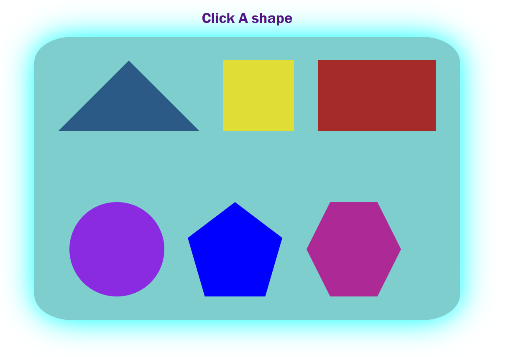

# CSS Shapes Project

This is a simple project using HTML, CSS, and JavaScript to display different shapes.

## Shapes Included

* Square
* Rectangle
* Circle
* Triangle
* Pentagon
* Hexagon

## Features

* Shapes arranged using Flexbox
* Hover zoom effect
* Click on shape → shows its name

## Technologies Used

* HTML
* CSS
* JavaScript

## How to Run

1. Open `index.html`
2. Click on shapes

