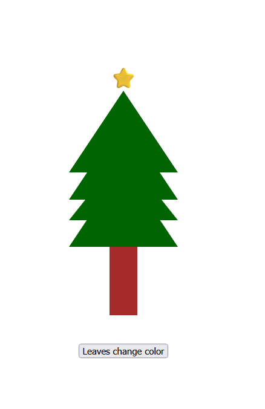

# 🎄 Christmas Tree (Mini Project)

A simple Christmas tree created using HTML, CSS, and JavaScript.

## ✨ Features

* Tree made using CSS triangles
* Star added on top ⭐
* Button to change tree colors

## 🛠️ Technologies

* HTML
* CSS
* JavaScript

## 🚀 How to Run

1. Download the project
2. Open `index.html` in browser

## 📌 Note

This is a beginner practice project.

